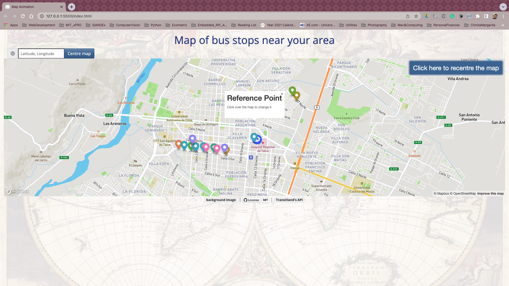
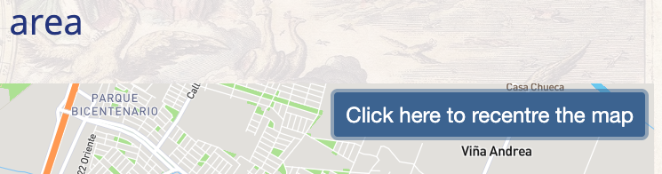
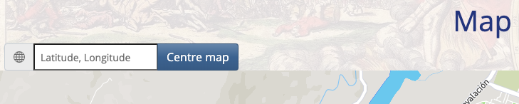

<h1 align="center">
  Bus stop tracker
   
</h1>
<h4 align="center">Feeding from external data</h4>

  
  
  
  

  <a href="#description">Description</a> •
  <a href="#file-manifest">Files</a> •
  <a href="#how-to-run">How To Run</a> •
  <a href="#roadmap-of-future-improvements">What's next?</a> •
  <a href="#contributing">Contributing</a> •
  <a href="#credits">Credits</a> •
  <a href="#license-information">License</a>

# :compass: Description 
Bus Stop Tracker is an application to identify bus stops near to a reference point. This is an exploratory excercise I am doing as part of the [full-stack web developer certificate](https://executive-ed.xpro.mit.edu/professional-certificate-coding) I am pursuing. 

The idea of this exercise is to build up on the concept of asynchronous programming and how to feed a webpage on external data to provide real-time experience to users. It also reinforces key learning concepts about front-end development, such as interacting with the [DOM](https://developer.mozilla.org/en-US/docs/Web/API/Document_Object_Model) and exploring the world of user interfaces with [CSS styles](https://www.w3schools.com/html/html_css.asp) and [bootstrap](https://getbootstrap.com/) templates.

By using the free tier services of [mapbox](https://www.mapbox.com/) and the javascript libraries [MapBoxGLJS](https://docs.mapbox.com/mapbox-gl-js/api/), a vector map of an area centred around a point is displayed on the page. The software then accesses real-time traffic data through free APIs provided by [transitland](https://www.transit.land/). In this first version, the bus stops near to the reference point (within a radius of 10km) are displayed by coloured markers. The information is refreshed every 60secs, by fetching new data through the API. 

This is a responsive website, built on [bootstrap](https://getbootstrap.com/) via [bootswatch](https://bootswatch.com) [Spacelab](https://bootswatch.com/spacelab/) theme. I also performed specific adjustements through my own css style file.

# :world_map: How to Run
The first time the page loads, it centres around [Talca](https://www.britannica.com/place/Talca) [(Chile)](https://en.wikipedia.org/wiki/Talca):chile:. I do not live there, I live 250km farther south, but it was the closest city where I could find data available to show :sweat_smile:

The map :world_map: can be zoomed in/out and panned by using the mouse, touchscreen or keyboard (:arrow_up_down: ↔️ to move around, :heavy_plus_sign: to zoom in and :heavy_minus_sign: to zoom out). 

To re-centre around the reference point, just hoover the mouse over the top-right corner and press the button **"Click here to recentre the map"**. Alternatively, a set of coordinates (latitude, longitude) can be typed directly into the text box (or copy and paste from e.g. [Google Maps](http://maps.google.com))

  

The reference point can easily be changed by clicking in another point in the map and by pressing **"Centre map"**, the information of the bus stops around the new reference point will be displayed. If there is no data available for the point, it is indicated in the tooltip.

  

<h2 align=center> <a href="https://jlulloaa.github.io/bustracking"> Explore the bus stop demo </a> </h2>

# Roadmap of future improvements
This is a fun exercise that allows practising with fetching external data and understanding the complexities of real-time UX. There are many services providing this type of GPS information, so this project can be a good learning place to understand how these other established services work. Some of the improvements I have in my ToDo list are:

* Differentiate the right from the left click to enable more functionalities. Currently, cannot open two or more tooltips simultaneously, only one is displayed, because that click also translate the centre. Being able to differentiate the right from left click, will allow to e.g. use the right click to display the tooltip and the left, to recentre the pointer 

* Display a counter with the number of bus stops found in the area. Also, will be nice to show the current radius and refresh time, and even been able to modify them

* For planning a route, it'll be usefull to provide the closest stop by [measuring the distance](https://en.wikipedia.org/wiki/Great-circle_distance) between the reference point and the bus stops. This information can also be displayed for every stop in the tooltip.

* Integrate other APIs to provide information from areas currently not served by [Transitland](https://www.transit.land/), and integrate information of underground trains

# Contributing
Pull requests are welcome, and I'll be happy to chat about any improvement or extension that could be donde to this app.

# Credits
This software uses the following third party tools:
* The background image was taken from [WallpaperAccess](https://wallpaperaccess.com/4k-old-map)
* [Bootstrap](https://getbootstrap.com/) based theme [Spacelab](https://bootswatch.com/spacelab/), from [bootswatch](https://bootswatch.com)
* [Animated gif of the bus](https://cliply.co/wp-content/uploads/2019/08/371908200_SCHOOL_BUS_400px.gif) in this README file
* [Animated gif of the spinning earth](https://acegif.com/wp-content/gifs/globe-44.gif) in this README file

# License information
This project is licensed under the terms of <a href="https://github.com/jlulloaa/bustracking/blob/main/LICENSE" target="_blank"> MIT license </a>

